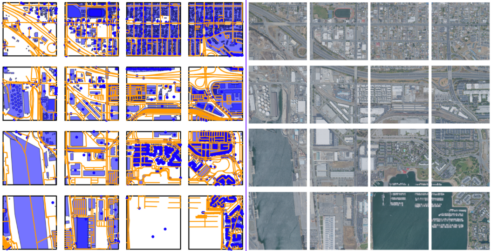
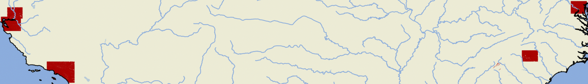
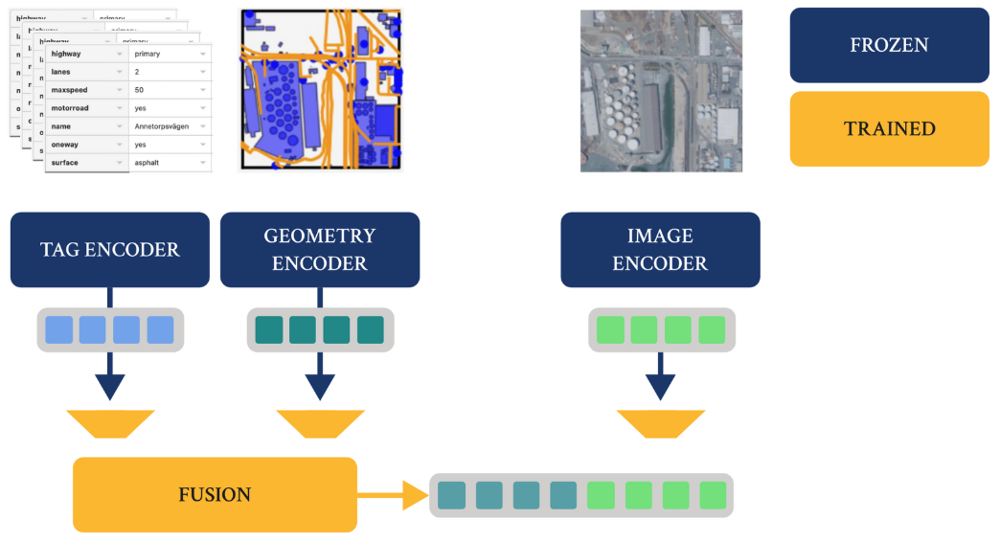
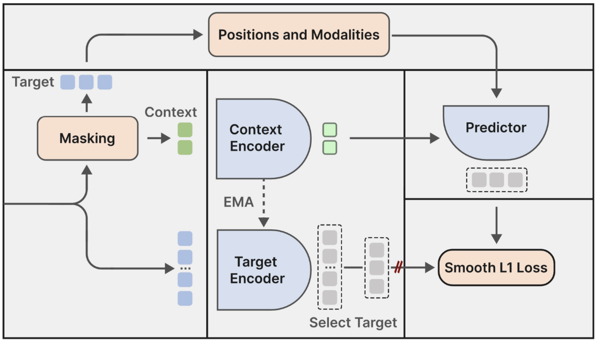
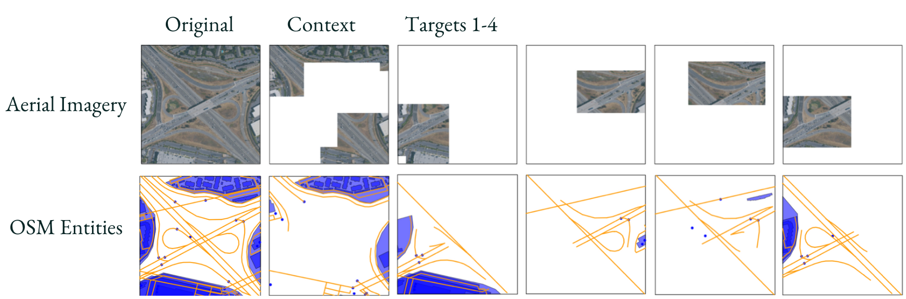
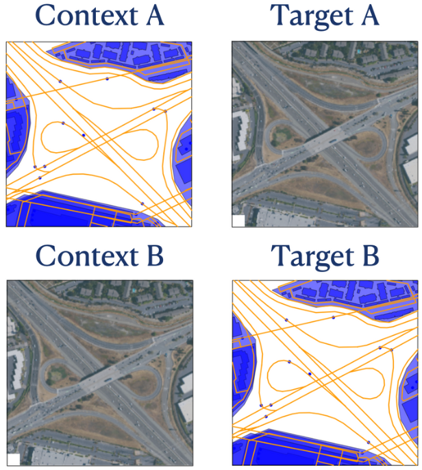

<div align="center">

# GeoJEPA: Towards Eliminating Augmentation- and Sampling Bias in Multimodal Geospatial Learning

[](https://arxiv.org/abs/2503.05774)

Official implementation of the paper <br/>
["GeoJEPA: Towards Eliminating Augmentation- and Sampling Bias in Multimodal Geospatial Learning"](https://arxiv.org/abs/2503.05774)

</div>

## TLDR;

- Elimination of augmentation and sampling biases in geospatial representation learning
- Multimodal fusion of OpenStreetMap attributes, geometries, relations, and aerial imagery
- Self-supervised pretraining using JEPA
- Novel JEPA masking strategies and conditional priors

## Summary and Insights
Building on the foundations of JEPA by Yann LeCun, GeoJEPA tackles the key challenges of multimodality, heterogeneity, and sampling bias in geospatial representation learning. Rather than relying on complex augmentations and positive/negative sampling, GeoJEPA reconstructs masked latent representations, enabling seamless integration of OpenStreetMap attributes, geometries, relations, and aerial imagery.

We demonstrate that JEPA is a promising architecture for learning semantic representations of urban regions and map entities. However, our work also uncovers intriguing challenges:

• **Optimisation Dynamics:** We observed a performance decline in later training stages, indicating an incomplete understanding of the optimisation landscape.

• **Multimodal Fusion:** Despite a painless integration of diverse modalities, the additional data does not always translate into performance gains, raising questions about balanced masking and loss across modalities.

• **Global-Information:** Some pre-trained tokenisation modules introduce global information, undermining the complexity of masked latent reconstruction.

• **Context vs. Entity:** At times, the embeddings seem to encode more of the contextual information than direct attributes of the targeted map entity. How can this balance be evaluated?


## Overview

GeoJEPA uses self-supervised pretraining on a large dataset of OpenStreetMap attributes, geometries and aerial images. The results are multimodal semantic representations of urban regions and map entities that we evaluate both quantitatively and qualitatively.

<div align="center">   
      <i>OSM data and aerial imagery clipped to a 300x300m grid. In total, the dataset spans 11M buildings, 6M roads, 400k crossings, and other types of OSM data available in the regions below.</i><br/>
      
</div><br/><br/>

<div align="center">
      <i>The dataset spans 5 cities in the U.S., San Fransisco, Sacramento, Los Angeles, Charlotte, and Washington.</i><br/>
      
</div><br/><br/>

<div align="center">
      <i>Separate encoders for geometry, tag attributes, and images. The tag and geometry representations are fused on the entity level. The tile is described by a sequence of entity tokens and image tokens.</i><br/>
      
</div><br/><br/>


<div align="center">
      <i>GeoJEPA training module, building on JEPA, but with novel masking strategies and conditional prior based on minimal bounding box and modality.</i><br/>
      
</div><br/><br/>

<div align="center">
      <i>Novel masking strategies for selecting context and targets tokens from geometries and image patches. GeoJEPA learns to predict the latent representation of the target from the latent representation of the context.</i><br/>
      <br/><br/>
      
</div>


## Checkpoints, data, and knn-queries
[GeoJEPA on iCloud](https://www.icloud.com/iclouddrive/0d3Azjr67Hn9q3EK89YJg-EMw#geojepa)

## Installation with conda

```bash
git clone git@github.com:theolundqvist/geojepa.git
cd geojepa

# create conda environment and install dependencies
bash install.sh

conda activate geojepa
```

## Training

Train model with default configuration:

```bash
python src/train.py experiment=01-07-geojepa-t
```

See scripts/ for more examples.

## Citation

If you find this work useful in your research, please consider citing:

```bibtex
@article{lundqvist2025geojepa,
      title={GeoJEPA: Towards Eliminating Augmentation- and Sampling Bias in Multimodal Geospatial Learning}, 
      author={Theodor Lundqvist and Ludvig Delvret},
      year={2025},
      author={Lundqvist, Theodor and Delvret, Ludvig},
      journal={arXiv preprint arXiv:2503.05774},
      url={https://arxiv.org/abs/2503.05774}, 
}
```

## License

This project is licensed under the Apache License 2.0 - see the [LICENSE](LICENSE) file for details.

